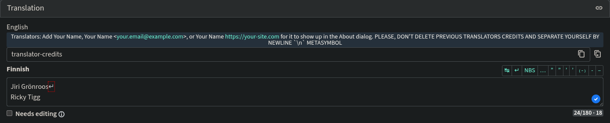

# Contributing

## Indirect Contributing
>[!TIP]
>Any issue that's already resolved but not published yet is marked with `fix-available` 
>label. If the issue is closed, then it was already published.

#### Feature Requests
If you want some feature to be implemented within the app, [create](https://github.com/Dzheremi2/Chronograph/issues) 
an issue with `Feature Request` template and describe what you want to be implemented. The 
more information about the feature you provide, the faster, and precisely, it would be 
implemented.

#### Bug Reports
If you found a bug, and you're not that lazy, then you should report this bug by [creating](https://github.com/Dzheremi2/Chronograph/issues) 
an issue with `Bug Report` template and provide as much information about it as possible.

>[!NOTE]
>If your issue got an `unable-reproduce` label, then you probably should give more 
>information about how it can be reproduced. Or this just means that this issue belongs 
>only to your side. Anyway, issues with `unable-reproduce` wouldn't be worked on until 
>they have got reproduced (`successfully-reproduced` label)

## Direct Contributing
#### Code Contributing
To directly contribute to the app, [fork](https://github.com/Dzheremi2/Chronograph/fork) 
the repo, make your changes and [open](https://github.com/Dzheremi2/Chronograph/pulls) a 
pull request against the `devel` branch. If your code satisfies the maintainer, then it 
would be merged, and you will be mentioned in the upcoming release and added to the 
`About App` section in the app.

>[!IMPORTANT]
>Code in pull requests should respect the [Project's Code Style](#code-style).

#### Internationalization
Another way to contribute to the app is internationalization. The app's using the 
[Hosted Weblate](https://hosted.weblate.org/projects/chronograph/chronograph/) for this 
purpose. If you're a translator, you could mention yourself by adding `Your Name`, 
`Your Name <your@e.mail>` or `Your Name https://your.site` to the `translator-credits` 
[string](https://hosted.weblate.org/translate/chronograph/chronograph/fi/?checksum=deecda9491124d4f&sort_by=-priority,position). 
This will add you to the `Translators` section in the `About App` for your language.



## Build

### Flatpak

In VSCode you can install [Flatpak](https://marketplace.visualstudio.com/items?itemName=bilelmoussaoui.flatpak-vscode) 
extension, select needed manifest (should be `build-aux/flatpak/io.github.dzheremi2.lrcmake_gtk.Devel.yaml`) 
and then use `Flatpak: Build` command from VSCode command palette.

### AppImage

1. Install the SDK:
  `flatpak install flathub org.gnome.Sdk//49`
2. Run the build script:
  `./build-aux/appimage/build.sh`

The AppImage will be placed in `_build/appimage/dist/`.

To build the development profile, run:
`./build-aux/appimage/build.sh development`

##### Dependencies:
org.gnome.Platform (v49)
```shell
flatpak install org.gnome.Platform/x86_64/49 --system
```
org.gnome.Sdk (v49)
```shell
flatpak install org.gnome.Sdk/x86_64/49 --system
```

## Code Style
The code is formatted by [Ruff](https://github.com/astral-sh/ruff) formatter. Imports are 
sorted by [isort](https://github.com/pycqa/isort).
The main IDE for developing this project is VSCode. Extensions for both these are 
available on VSCode Marketplace. The current configuration is embedded within the repo 
(`.vscode/settings.json`)

### Type Hints and Docstrings
All new methods and static variables should have type annotations. All public methods and 
functions must have docstrings in NumPy format 
([extension](https://marketplace.visualstudio.com/items?itemName=njpwerner.autodocstring) 
for automatic docstrings generation). If a public method has arguments that are not 
suppressed, they must be described in the docstring.

### Visibility and Access Control
Methods and functions that are only used within their class or module must be marked as 
private by prefixing them with an underscore (`_method_name`). Only expose public APIs 
through unprefixed method names.

### Docstring Format Requirements
Follow these specific rules when writing docstrings in NumPy format:

- All parameter descriptions and type annotations must appear in a `Parameters` section
- All return descriptions and type annotations must appear in a `Returns` section
- Exception documentation must appear in a `Raises` section
- Use 2 spaces for indentation between section headers and their content

When describing parameters and returns, follow this structure:
```
Parameters
----------
param_name : type
  Description of the parameter.

Returns
-------
return_type
  Description of what is returned.
```

### Type Annotations
- Every function argument must have an explicit type annotation, except for arguments you 
  intend to suppress from the public interface
- If a function suppresses all its arguments except `self` (if applicable), add `*_args` 
  after the last non-suppressed argument to explicitly indicate this
- Every function must have an explicit return type annotation, even if it returns `None`
- Use `Union` from the `typing` module for union types instead of Python's built-in 
  union syntax (`|`)

### Properties
Docstrings for properties should only be added to the property getter. The docstring 
should contain only the property description without listing parameters or return type 
information. This project uses two property patterns:
- Python's built-in `@property` decorator
- GTK's `GObject.Property` for GTK-related properties

### Abstract Methods
If a method is declared in an abstract base class that your class inherits from, do not 
add a docstring to the implementation—the abstract method's docstring is already available 
and will be inherited.

### Formatting
- Use 2-space indentation throughout the codebase
- When reading files, always explicitly set encoding to `utf-8`

>[!NOTE]
>If you're too lazy to do all these things, please, mention it in your pull request 
>message for the maintainers to do this instead of you.

>[!TIP]
> Also, if you don't understand something, you could research the repo structure or ask 
>the maintainer for help on the [Discussions](https://github.com/Dzheremi2/Chronograph/discussions)