

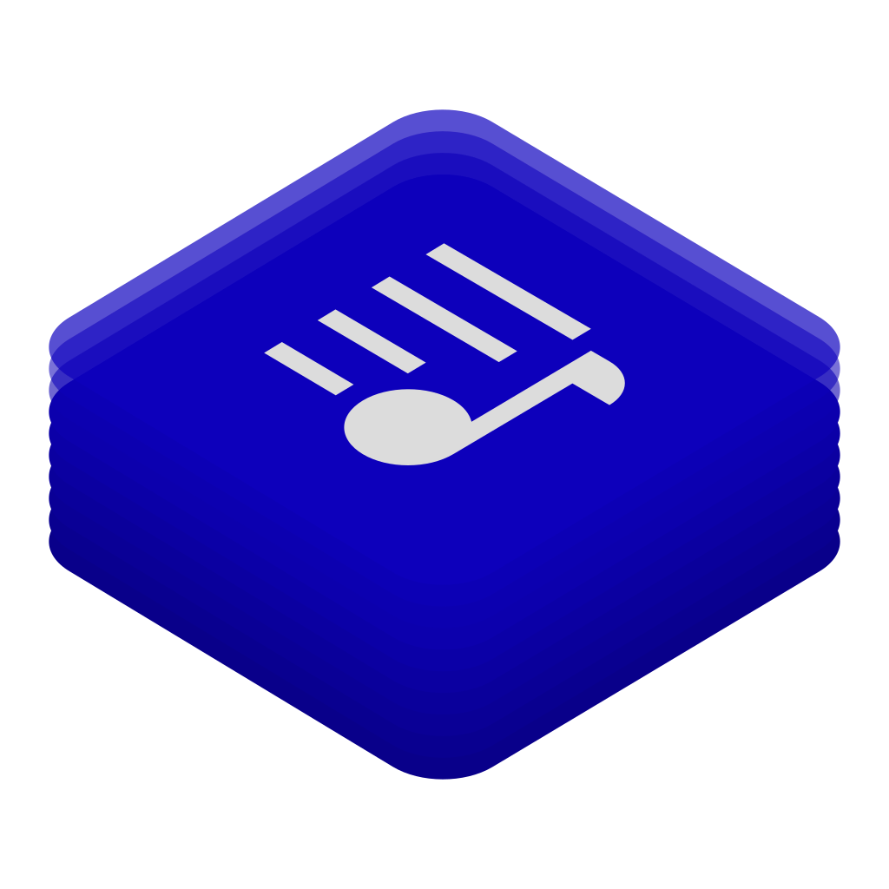

# Chronograph
**_Sync Lyrics of Your Loved Songs_** 🕒

[flathub-url]: https://flathub.org/apps/io.github.dzheremi2.lrcmake-gtk
[installs-img]: https://img.shields.io/flathub/downloads/io.github.dzheremi2.lrcmake-gtk?style=for-the-badge&color=gree&logo=flathub

[![Installs][installs-img]][flathub-url]

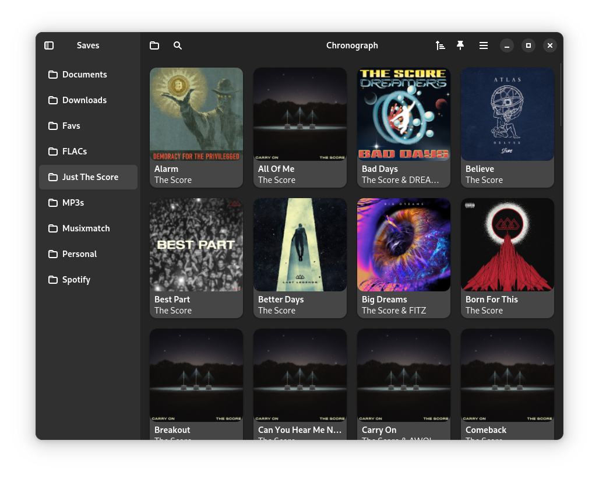

### About Chronograph
Chronograph is an open-source application designed for accurately syncing lyrics with 
audio timestamps.

You may notice that many of music players support synced lyrics which are highlighted 
line-by-line or word-by-word while playing? This app was designed to give the community an 
ability to be the ones who make these lyrics.

Chronograph directly supports publishing to [LRCLib](https://lrclib.net). As many FOSS 
music players use LRCLib to fetch synchronized lyrics, this integration allows users to 
easily contribute their work back to the open-source community.

**Syncing Modes**
- **Line-by-Line (Primary)**: Here, every time you do sync action, timestamp is placed for 
the whole line of lyrics. This is the most supported format of synced lyrics.
- **Word-by-Word (Advanced)**: Designed for true karaoke quality. It places a timestamp 
for every single word, enabling players to animate lyrics with precision.

**Supported Formats**
- OGG
- FLAC
- MP3
- M4A
- OPUS
- WAV
- AAC (reduced functionality)

### Installation

You can download app either on [Flathub](https://flathub.org/apps/io.github.dzheremi2.lrcmake-gtk) 
or by downloading and installing bundle from the [latest release](https://github.com/Dzheremi2/Chronograph/releases/latest)

### Releases

Chronograph has three types of releases *stable*, *release candidates (beta)* and 
*devel (alpha)*

#### Stable

Stable releases are available on Fridays (if not a hotfix) if their develepment cycle has 
ended. Could be downloaded either on [Flathub](https://flathub.org/apps/io.github.dzheremi2.lrcmake-gtk) 
or via [GitHub Releases]((https://github.com/Dzheremi2/Chronograph/releases/latest))

#### Release Candidate

RCs are published before the stable release in friday-awaiting time for users to be able 
to test them and report bugs before the release happens.
Could be downloaded only on [GitHub Releases](https://github.com/Dzheremi2/Chronograph/releases/). 
RCs are marked as `Pre-release`

#### Devel

Devel build are formed for every commit on any branch except for `main`. These build are 
casts of the current development state, so treat them as *Alpha* releases

>[!CAUTION]
>Devel builds may be unstable or don't even launch. Use it at your own risk

### Changelog
You can see full changelog for all versions [here](docs/CHANGELOG.md)

### Translation
You can help project to be internationalized using [Hosted Weblate](https://hosted.weblate.org/projects/chronograph/chronograph/)

##### Translation status

### Plans
You can see future plans on Projects page of this repo on [Chronograph roadmap.](https://github.com/users/Dzheremi2/projects/2)

If you have an idea or you know a bug, please, open an [issue](https://github.com/Dzheremi2/Chronograph/issues) 
with you idea/bug and it will be added to roadmap.

If you want the app to support more file formats, create a feature request about that and 
attach a sample file.

### Code of Conduct
The project follows the [GNOME Code of Conduct](https://conduct.gnome.org)

### Contributing
All contribution instructions are described in [CONTRIBUTING.md](https://github.com/Dzheremi2/Chronograph/blob/master/CONTRIBUTING.md) 
file.

### Screenshots

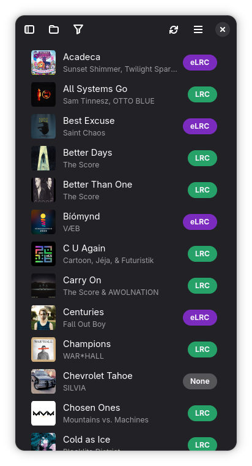
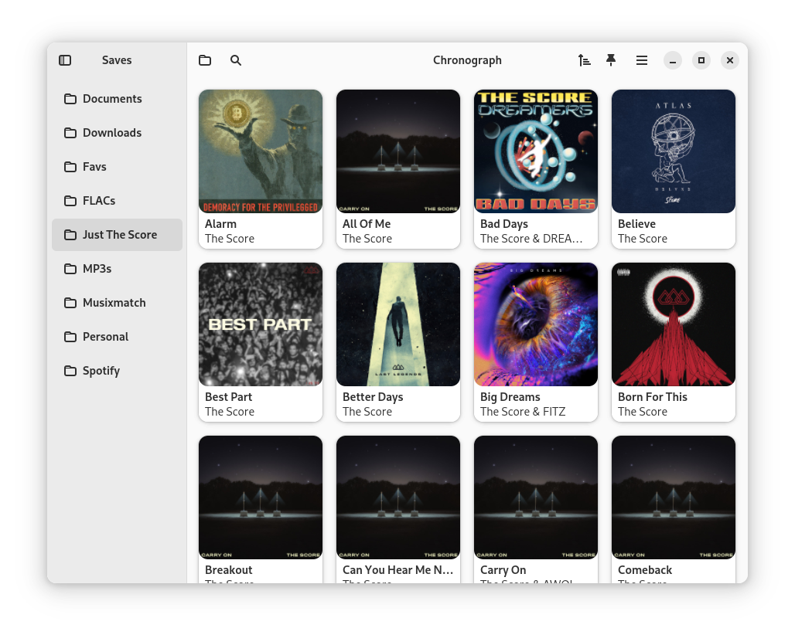
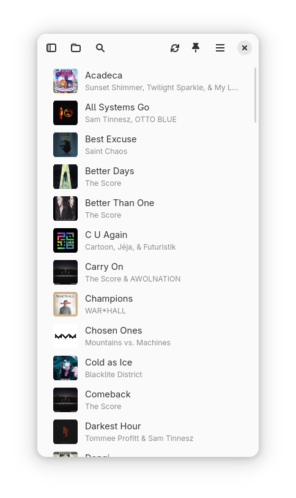
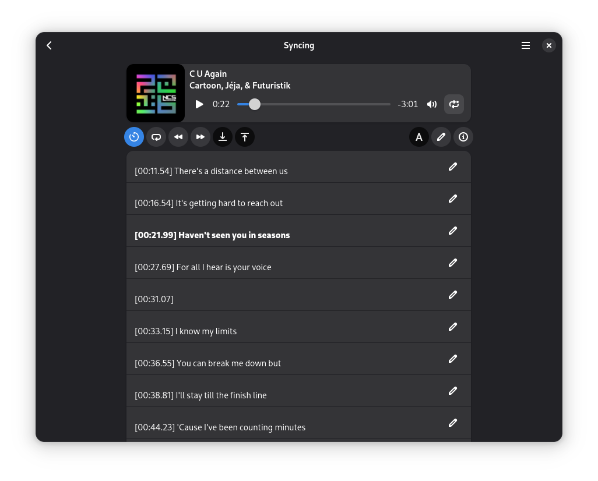
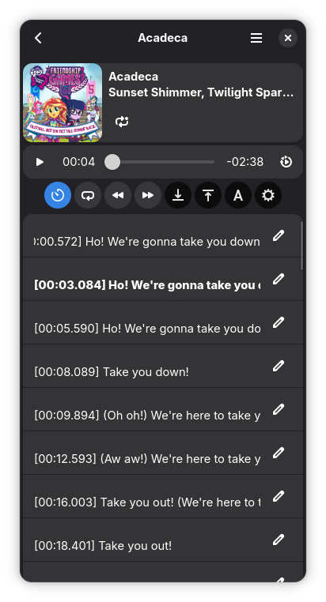
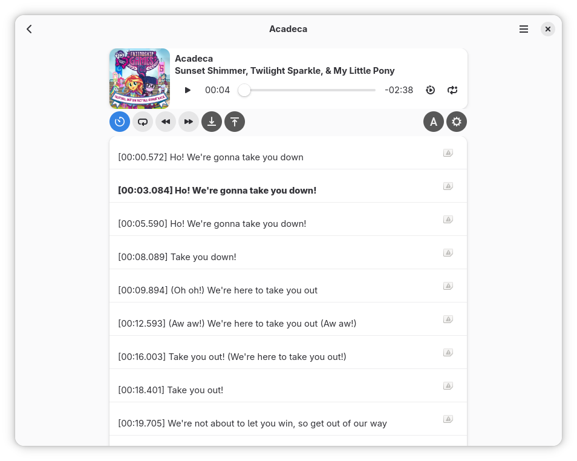
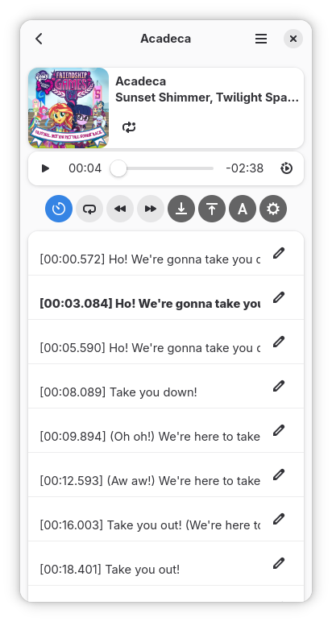
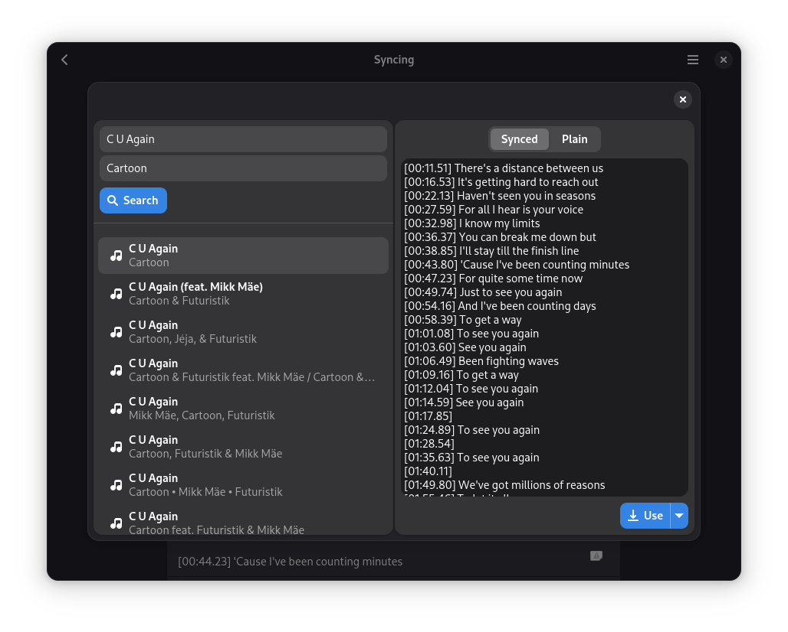
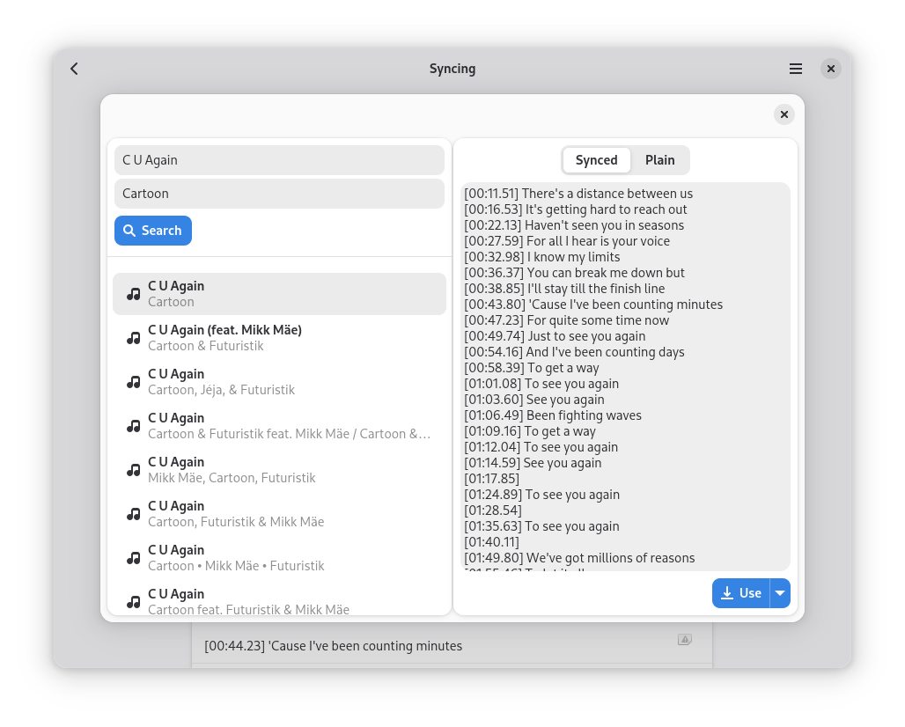
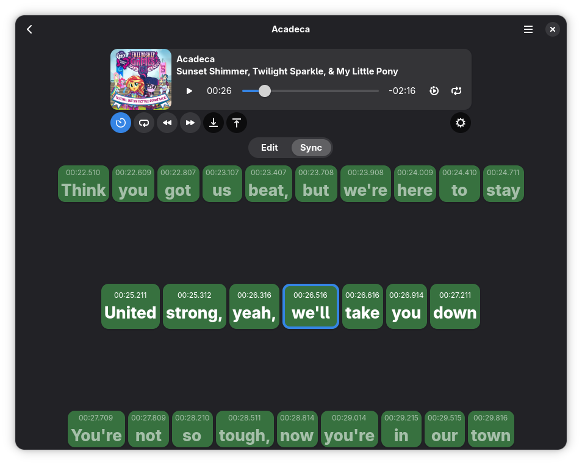
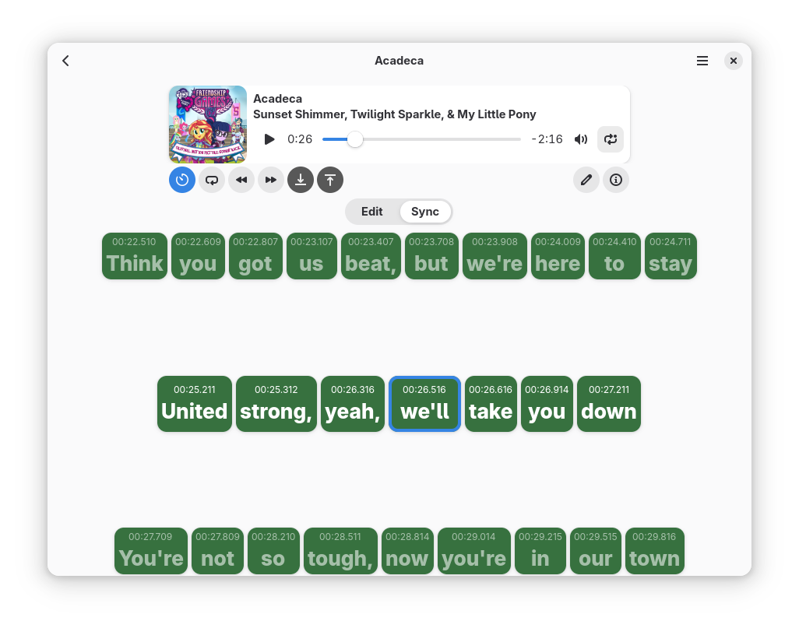

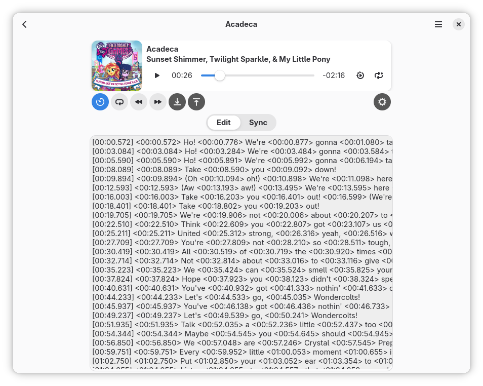

 