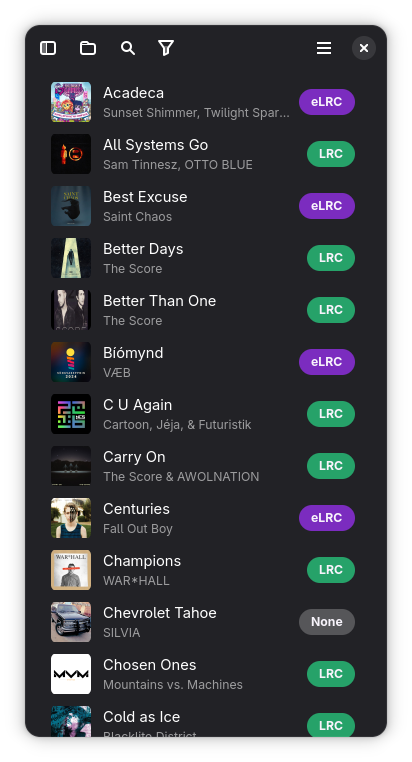
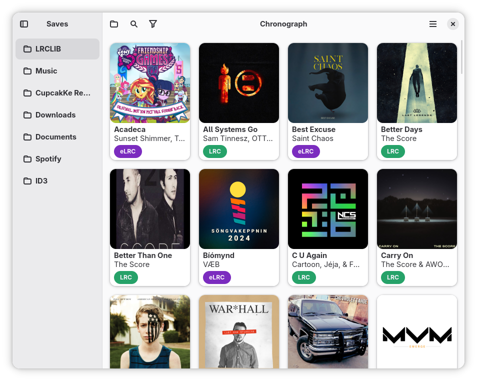
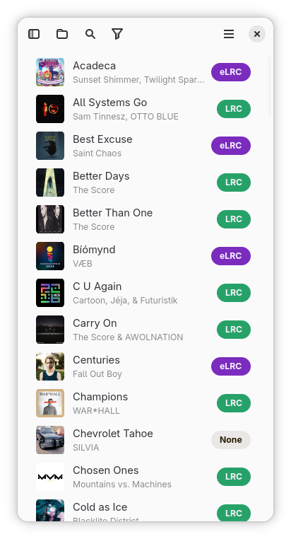
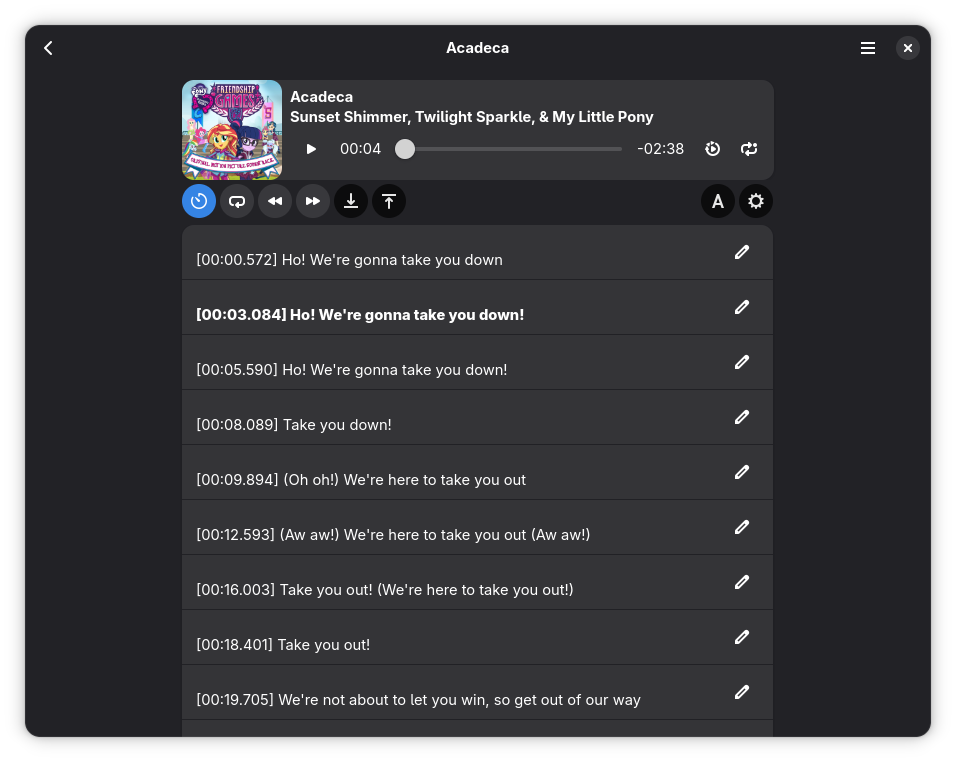
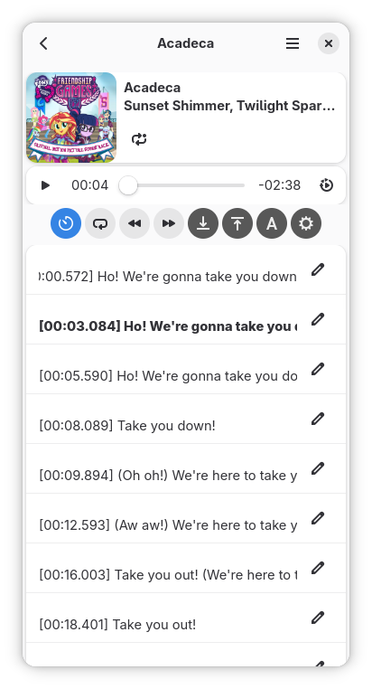
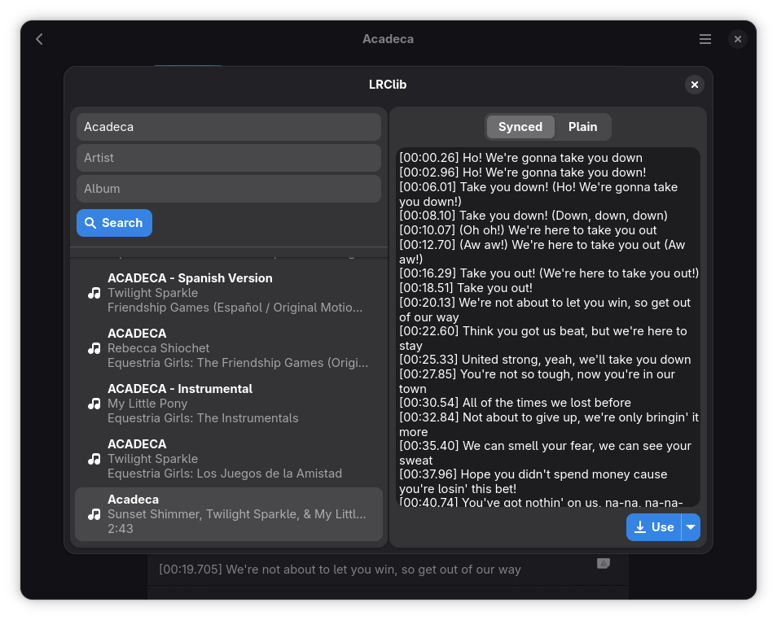
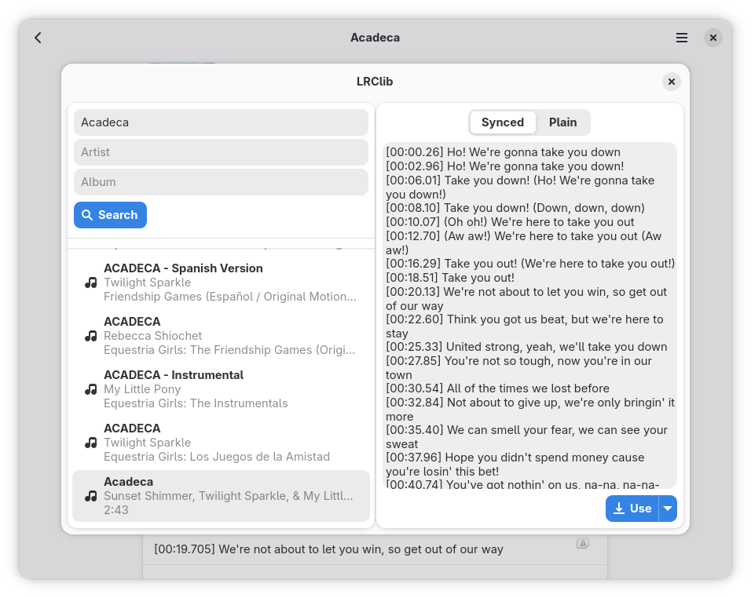
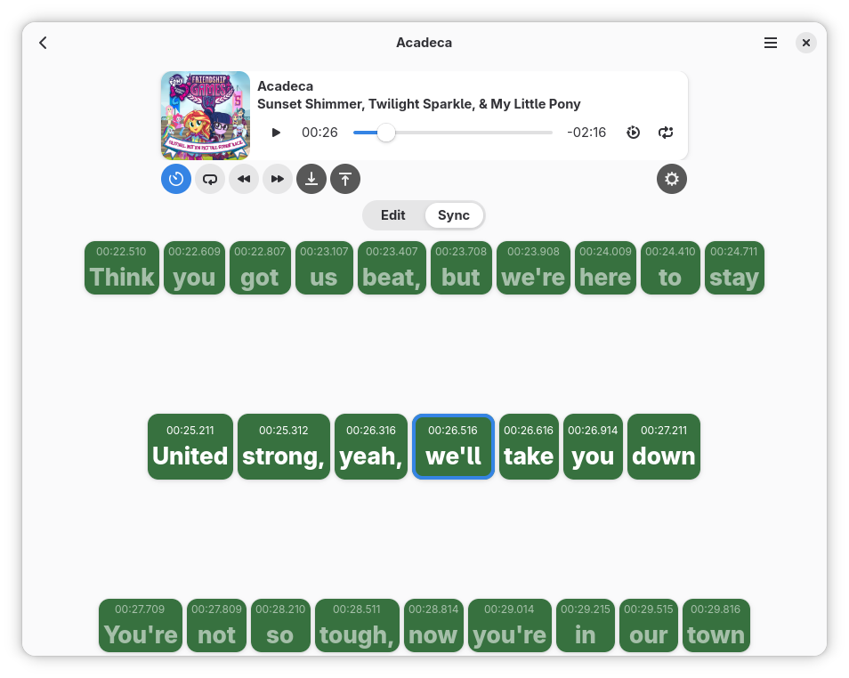
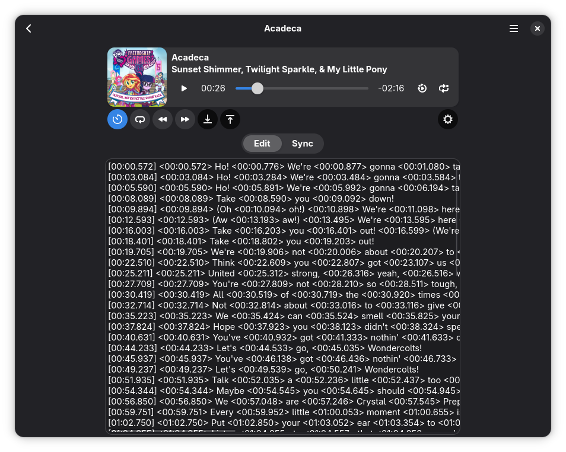

# Chronograph
[flathub-url]: https://flathub.org/apps/io.github.dzheremi2.lrcmake-gtk
[installs-img]: https://img.shields.io/flathub/downloads/io.github.dzheremi2.lrcmake-gtk?style=for-the-badge&color=gree&logo=flathub

[![Installs][installs-img]][flathub-url]

### About Chronograph
Chronograph is the app for syncing song lyrics by timestamps. 
Chronograph supports `.ogg`, `.flac`, `.mp3`, `.m4a`, `.opus` and `.wav` media formats.
Also it supports `.aac` format, but without metadata reading, editing and automatic publishing to the [LRClib](https://lrclib.net).
You can import lyrics from Clipboard, File or from LRClib and export your lyrics to these destinations.
Chronograph also supports Word-by-Word syncing in eLRC format for true karaoke effect in supported players

### Installation

You can download app either on [Flathub](https://flathub.org/apps/io.github.dzheremi2.lrcmake-gtk) or by downloading and installing bundle from the [latest release](https://github.com/Dzheremi2/Chronograph/releases/latest)

### Releases

Chronograph has three types of releases *stable*, *release candidates (beta)* and *devel (alpha)*

#### Stable

Stable releases are available on Sundays (if not a hotfix) if their develepment cycle has ended. Could be downloaded either on [Flathub](https://flathub.org/apps/io.github.dzheremi2.lrcmake-gtk) or via [GitHub Releases]((https://github.com/Dzheremi2/Chronograph/releases/latest))

#### Release Candidate

RCs are published before the stable release in sunday-awaiting time for users to be able to test them and report bugs before the release happens.
Could be downloaded only on [GitHub Releases](https://github.com/Dzheremi2/Chronograph/releases/). RCs are marked as `Pre-release`

#### Devel

Devel build are formed for every commit on any branch except for `main`. These build are casts of the current development state, so treat them as *Alpha* releases

>[!CAUTION]
>Devel builds may be unstable or don't even launch. Use it at your own risk

### Changelog
You can see full changelog for all versions [here](docs/CHANGELOG.md)

### Translation
You can help project to be internationalized using [Hosted Weblate](https://hosted.weblate.org/projects/chronograph/chronograph/)

##### Translation status

### Plans
You can see future plans on Projects page of this repo on [Chronograph roadmap.](https://github.com/users/Dzheremi2/projects/2)

If you have an idea or you know a bug, please, open an [issue](https://github.com/Dzheremi2/Chronograph/issues) with you idea/bug and it will be added to roadmap.

If you want the app to support more file formats, create a feature request about that and attach a sample file.

### Code of Conduct
The project follows the [GNOME Code of Conduct](https://conduct.gnome.org)

### Contributing
All contribution instructions are described in [CONTRIBUTING.md](https://github.com/Dzheremi2/Chronograph/blob/master/CONTRIBUTING.md) file.

### Screenshots

 